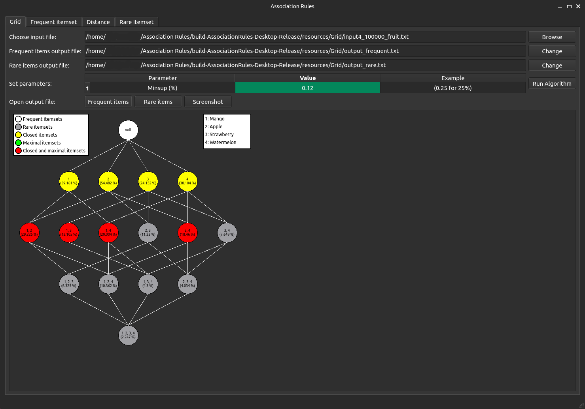
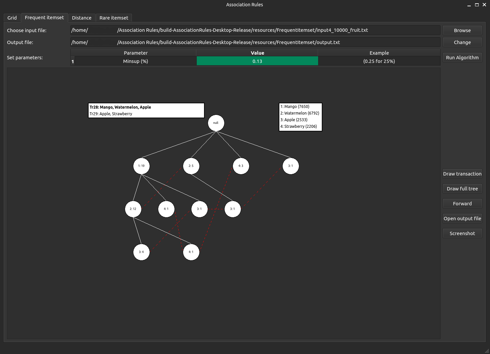
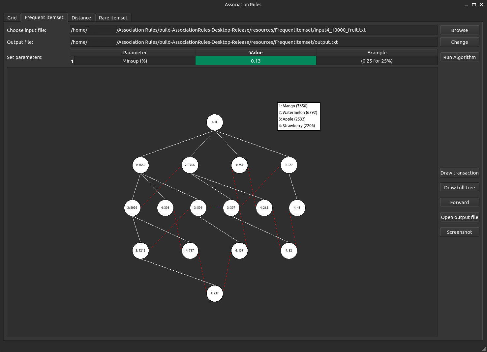
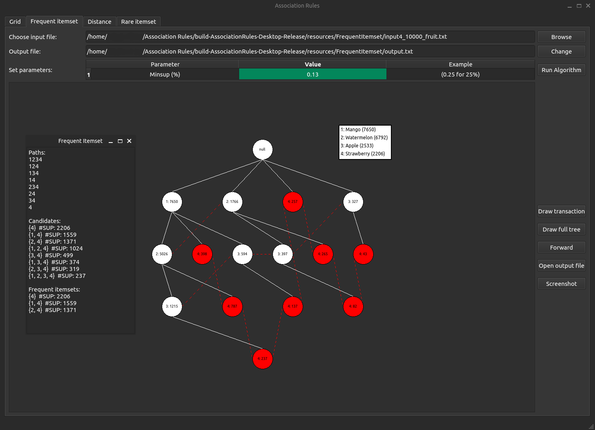
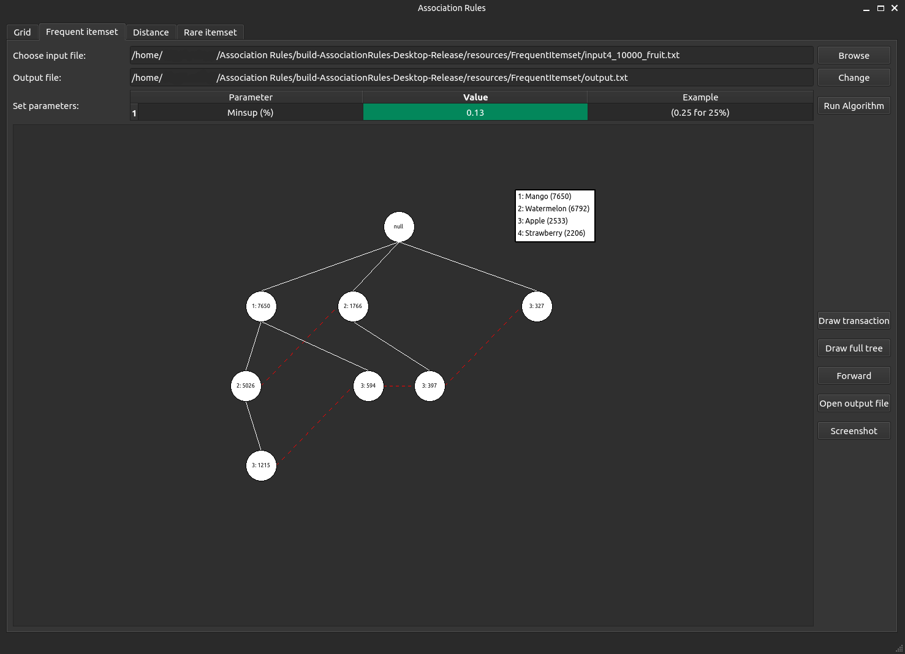

## Introduction
This project, developed in Qt C++ for the Data Mining course, 
implements concepts related to association rules in data mining. 
It includes a drawing grid, the FP-Tree algorithm for frequent 
itemsets, methods for measuring distance between vectors 
(Euclidian, Cosine, Mahalanobis, etc.), and an algorithm for 
finding rare itemsets

## Prerequisites
- Qt Creator 
- Qt6
- C++

## Build
```bash
git clone https://gitlab.com/fjovanovicc/association-rules.git
cd association-rules/AssociationRules

open CMakeLists.txt file in Qt Creator
```

## Input data
Input data can be found in `AssociationRules/resources/tab*/` 
directory, where `tab*` is one of the tabs in the app. 
Data was generated using Python script, but any data that is 
represented as strings / numbers separated by comma and space 
(`Apple, Mango`) can be used. Each line represents 1 transaction

## Definitions 
- **Support** of a rule $A \implies B$, represented as **sup**, 
is defined as the quotient of the number of transactions 
containing A and B in relation to the total number of 
transactions:
$sup(A \implies B) = \frac{\#(A \cup B)}{N}$
  <details>
    <summary>Example</summary>
      <table>
        <tr>
          <th>Transaction ID</th>
          <th>Items</th>
        </tr>
        <tr>
          <td>1</td>
          <td>Apple, Pear, Strawberry</td>
        </tr>
        <tr>
          <td>2</td>
          <td>Apple, Strawberry, Mango, Peach</td>
        </tr>
        <tr>
          <td>3</td>
          <td>Cranberry, Apple</td>
        </tr>
        <tr>
          <td>4</td>
          <td>Cherry, Apricot, Banana</td>
        </tr>
        <tr>
          <td>5</td>
          <td>Apple, Grapes, Kiwi, Strawberry</td>
        </tr>
      </table>

    $sup(Apple \implies Strawberry) = \frac{\#(Apple\quad \cup\quad Strawberry)}{5} = \frac{3}{5} = 0.6 = 60\%$
  </details>

- **Confidence** of a rule $A \implies B$, represented as 
**conf**, is defined as the quotient of the number of 
transactions containing A and B in relation to the number of 
transactions containing A: 
$conf(A \implies B) = \frac{\#(A \cup B)}{\#(A)}$
  <details>
    <summary>Example</summary>
      <table>
        <tr>
          <th>Transaction ID</th>
          <th>Items</th>
        </tr>
        <tr>
          <td>1</td>
          <td>Apple, Pear, Strawberry</td>
        </tr>
        <tr>
          <td>2</td>
          <td>Apple, Strawberry, Mango, Peach</td>
        </tr>
        <tr>
          <td>3</td>
          <td>Cranberry, Apple</td>
        </tr>
        <tr>
          <td>4</td>
          <td>Cherry, Apricot, Banana</td>
        </tr>
        <tr>
          <td>5</td>
          <td>Apple, Grapes, Kiwi, Strawberry</td>
        </tr>
      </table>

    $conf(Apple \implies Strawberry) = \frac{\#(Apple\quad \cup\quad Strawberry)}{\#(Apple)} = \frac{3}{4} = 0.75 = 75\%$
  </details>

- **Maximal frequent sets of items**: a set of items is 
maximally frequent if none of its immediate supersets is frequent

- **Closed sets of items**: a set of items is closed if none 
of its immediate supersets have the same support

## Tab Grid
- The task is to draw a grid of items and to find closed, 
maximal, closed and maximal sets of items
- On the image below we can see an example of the grid from 
one of the input data for 0.12 (12%) minimum support 

<center></center>  

- Field `Choose input file` is the file with input data
- Field `Frequent items output file` is the file where 
frequent items will be written with the support
- Field `Rare items output file` is the file where rare items 
will be written with the support
- `Set parameters` is table for, in this case, minimum support
that is a number (0, 1]
- Button `Frequent items` will open previously mentioned file 
that contains frequent sets of items with their support
- Button `Rare items` will open previously mentioned file 
that contains rare sets of items with their support
- Button `Screenshot` will take a screenshot of the current 
state of the app
- Button `Run Algorithm` will draw the grid and write the 
results in corresponding files

## Tab Frequent itemset
- This tab is demonstrating the build of FP tree transaction 
by transaction and then finding frequent itemsets.
- Except for previously mentioned fields that are the same 
we have some additional buttons and modification of some
- `Run Algorithm` will configure some things in the background 
and draw root (null) node with legend on the right side 
that is mapping numbers to the items (represented in the node)
- `Draw transaction` button will add one by one transaction in the 
FP tree, as each item is being added number of that prefix 
is being increased

<center></center> 

- `Draw full tree` button will draw full tree

<center></center> 

- `Forward` button will at first interaction color the nodes, show 
candidates with their support and choose frequent out of all of them 

<center></center> 

- At the second interaction the nodes will be removed. This will repeat 
until we are left with only null node

<center></center> 

- `Open output file` will open file that contains frequent sets 
of items with their support
- `Screenshot` will take a screenshot of the current state of the app